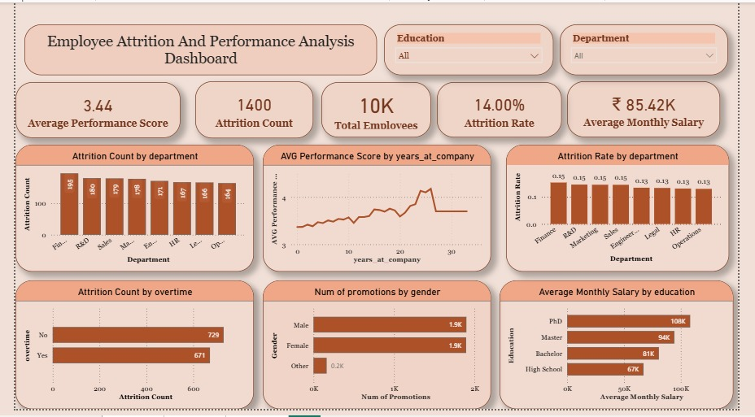
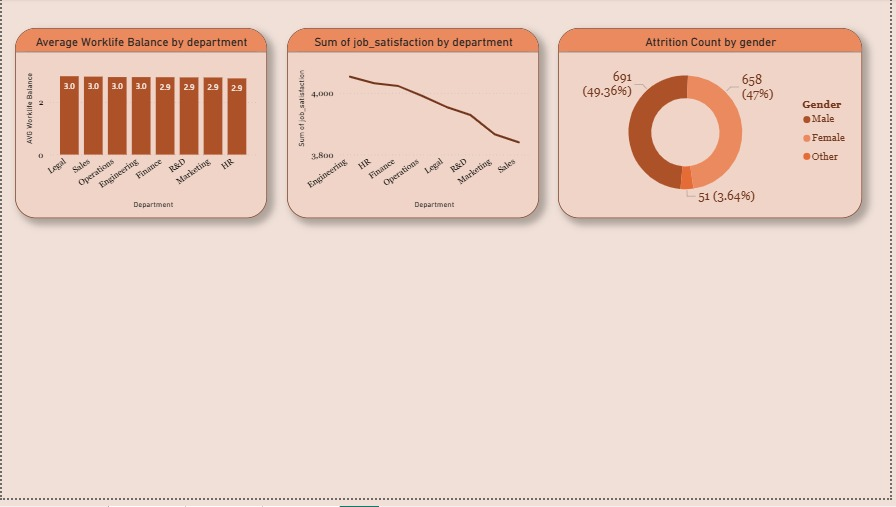

# 📊 Employee Attrition Analysis Dashboard – Power BI

## 🔍 Problem Statement

Employee attrition is a major challenge for organizations as it directly impacts productivity, hiring costs, and team stability.  

The objective of this project is to analyze HR data and identify key factors contributing to employee turnover using data-driven insights.

## 🎯 Project Objective

To design an interactive Power BI dashboard that:

- Identifies departments with high attrition
- Analyzes the relationship between salary, work-life balance, and employee turnover
- Examines performance trends and tenure impact
- Provides actionable business insights to improve retention

## 📁 Dataset Overview

The dataset contains employee-level HR information, including:

- Employee ID
- Age & Gender
- Department & Job Role
- Salary
- Work-Life Balance Rating
- Performance Rating
- Years at Company
- Attrition Status (Yes/No)

The data was cleaned and modeled in Power BI for analytical reporting.

## 📊 Dashboard Features

✔ Overall Attrition Rate KPI  
✔ Department-wise Attrition Breakdown  
✔ Work-Life Balance vs Attrition Analysis  
✔ Salary Distribution & Impact on Retention  
✔ Performance Rating Analysis  
✔ Interactive Slicers for Dynamic Filtering  

## 📈 Key Insights Derived

- Overall attrition rate observed: 14% of total employees.
- Sales department recorded the highest turnover compared to other departments.
- Employees with Work-Life Balance rating below 3 showed significantly higher attrition.
- Majority of employees leaving had tenure between 0–3 years.
- Lower salary bands experienced more frequent turnover.

## 💡 Business Recommendations

Based on analysis:

- Improve work-life balance initiatives in high-risk departments.
- Review compensation structure for lower salary bands.
- Strengthen early employee engagement programs.
- Implement retention strategies for critical job roles.
- Monitor tenure-based attrition patterns proactively.

## 🔄 Project Workflow

1. Data Cleaning and Validation
2. Data Modeling and Relationship Creation
3. DAX Measure Development
4. Dashboard Design & KPI Selection
5. Insight Extraction and Business Recommendations

## 🛠 Tools & Technologies Used

- Microsoft Power BI
- DAX (Data Analysis Expressions)
- Data Modeling
- Data Cleaning & Transformation
- HR Analytics Concepts

## 🧠 DAX Measures Used 

* Attrition Rate % =
DIVIDE(
    COUNTROWS(FILTER(Employee, Employee[Attrition] = "Yes")),
    COUNTROWS(Employee)
)

* Total Employees = COUNT('employee_attrition'[employee_id])

Attrition Count =
CALCULATE(
    COUNT('employee_attrition'[employee_id]),
    'employee_attrition'[attrition] = "Yes"
)

* Avg Monthly Salary = AVERAGE('employee_attrition'[monthly_salary])

* Avg Performance Score = AVERAGE('employee_attrition'[performance_score])

## 📷 Dashboard Preview

### Overview Dashboard

### Department & Work-Life Balance Analysis

## 🚀 How to Use

1. Download the `.pbix` file.
2. Open using Microsoft Power BI Desktop.
3. Interact with slicers and filters to explore insights.

## 📌 Project Type

HR Analytics | Business Intelligence | Data Visualization

## 👨‍💻 Author

Bharti  
TYBScIT Student  
Aspiring Data Analyst
